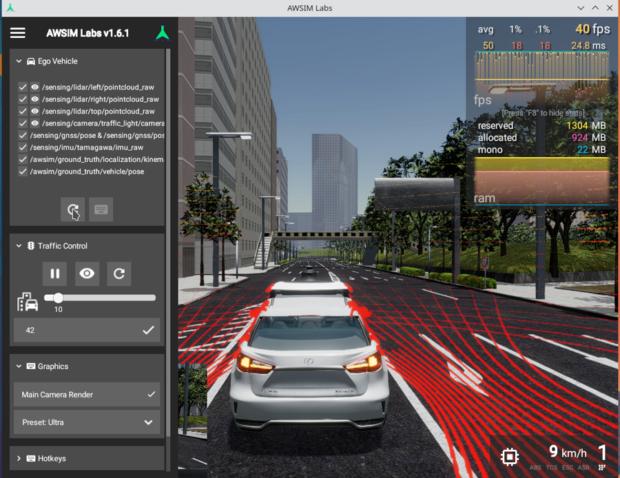
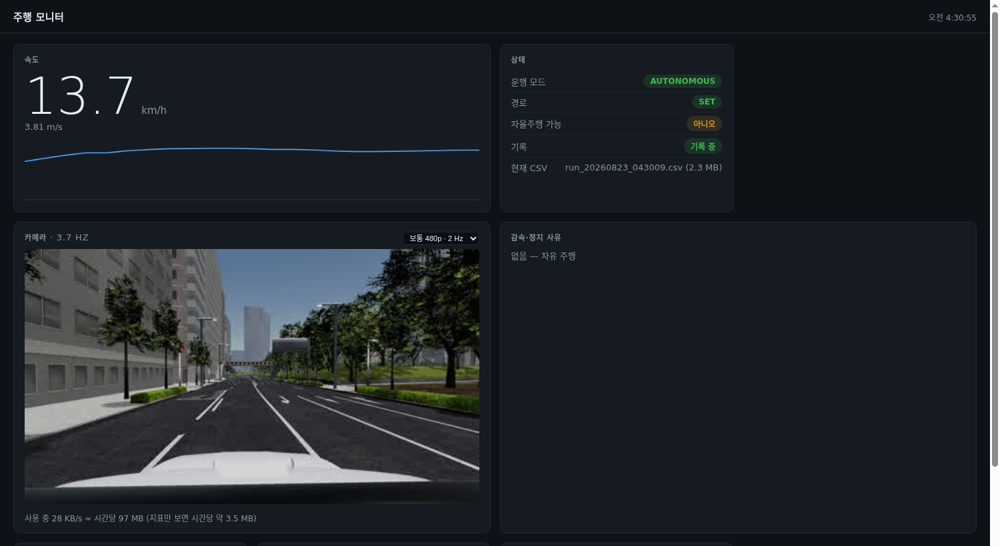
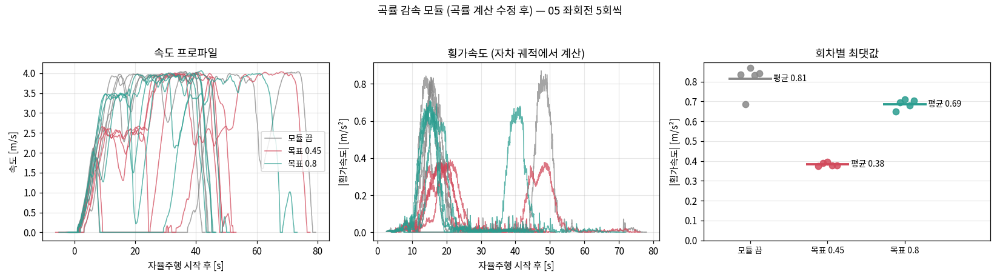
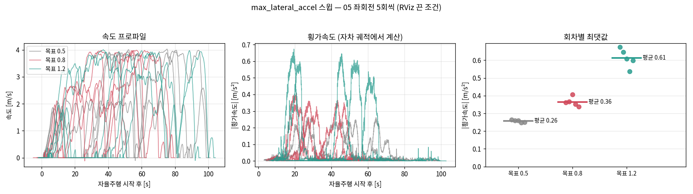
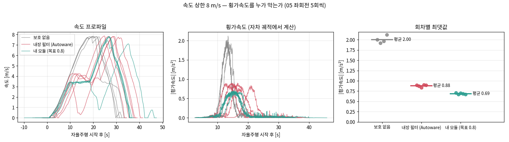
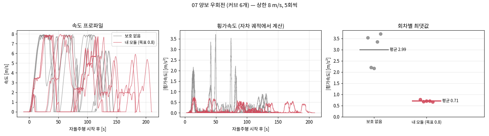
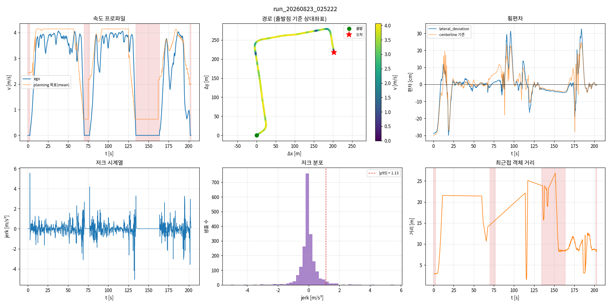

# awsim-autoware-bench

AWSIM Labs 1.6.1 + Autoware 1.9.0 (ROS 2 Humble) 가상 도심 자율주행 —
**주행을 측정 가능하게 만드는 평가 하네스**를 직접 만들고, 그걸로 실제 발견을 남긴 개인 프로젝트.

> 한 줄 요약: Autoware가 흘려보내는 지표를 주행 1회 단위로 붙잡아 반복·비교 가능하게 만들었고,
> 그 도구로 **MPC 횡오차 가중치의 교환비(추종 −41% ↔ 조향 +170%)** 를 측정했으며,
> **외부 신호 주입으로 빨간불을 통과시킬 수 있다**는 것을 3회 재현으로 확인했다
> (그 과정에서 내가 앞서 적었던 반대 결론을 스스로 뒤집었다).

그리고 그 하네스로 **직접 만든 계획 모듈**을 검증한다 — 곡률 감속 모듈은 보호가 없을 때
**0.38 g까지 치솟는** 회전 횡가속도를 **9개 커브 전부에서 0.77 m/s² 아래**로 묶었다.
그 과정에서 **하네스가 내 모듈의 곡률 계산 버그를 수치로 잡아냈고**, 앞서 발표한 수치를 정정했다.

| 시뮬레이터 (AWSIM Labs) | 실시간 모니터 (직접 제작) |
|---|---|
|  |  |

실행 환경: vast.ai GPU 컨테이너(RTX 3090), 도쿄 니시신주쿠 공식 샘플 맵.
좌측통행은 스택 설정이 아니라 **지도의 `turn_direction` 속성**이다 — Autoware에는
`left_hand` 같은 파라미터가 존재하지 않으며, 우측통행 지도를 넣으면 코드 수정 없이 우측통행으로 동작한다.

---

## 문제의식

Autoware의 `planning_evaluator` / `control_evaluator`는 지표를 실시간으로 발행하지만,
**아무도 그것을 주행 1회 단위로 모으거나 회차 간 비교하지 않는다.**
"돌아간다"와 "측정했다" 사이의 그 빈자리를 채우는 것이 이 저장소다.

## 무엇을 만들었나 — `src/autoware_bench/`

| 구성 | 역할 |
|---|---|
| `metrics_collector` | 주행 1회(경로 SET→ARRIVED 자동 감지)를 long-format CSV로 기록. 평가 지표 94종 + **정지 사유**(`velocity_factors`의 모듈명) + **개별 인지 객체**(거리·속도·분류) |
| `scenario_runner` | YAML 하나로 무인 완주: AWSIM 리셋 → 위치추정 재초기화(**정답 대비 오차 검증 후 출발**) → 경로 → engage → 도착. 장애물 스폰, 신호 강제(빨강→정지 확인→초록) 지원 |
| `run_batch.sh` / `run_ab.sh` | 반복 실행(러너 종료코드로 성공 판정)과 파라미터 A/B |
| `compare_runs.py` | 반복 편차 측정 + A/B 비교. **차이가 반복 편차보다 작으면 "판단 보류"** — 개선/악화를 주장하지 않는다 |
| `check_criteria.py` + `criteria.yaml` | 합격 판정. 임계값은 기본 파라미터 10회 관측치에서 도출 — 근거 없는 숫자를 먼저 박지 않는다 |
| `run_report.py` | 주행 1회를 6분할 그림 + 요약으로. 정지마다 **세운 모듈**과 거리를 표기 |
| `plot_ab.py` | 배치 묶음들을 그림 한 장으로 — 속도 프로파일·횡가속도·회차별 최댓값 |
| `dashboard` | 실시간 HMI. 속도·모드·기록 상태와 **지금 어느 모듈이 왜 세우는지**를 브라우저로 |
| `preflight.sh` / `restart_stack.sh` | 무인 배치를 위한 사전 점검·자동 복구 (실패 4종은 러너에게 같은 한 줄로만 보인다) |
| `set_signal_priority.sh` | 신호를 통제 가능하게 — 반복 편차의 최대 원인을 제거한다 (**측정 전용**) |

그리고 Autoware 쪽에 **직접 만든 계획 모듈** 하나:

| 구성 | 역할 |
|---|---|
| `autoware_behavior_velocity_curve_slowdown_module` | 경로 곡률에서 `v = √(a_lat/κ)` 상한을 만들어 **곡선 진입 전부터** 건다. `enable` 을 런타임 토글해 같은 스택에서 A/B 를 돌린다 |

## 무엇을 측정했나

### MPC 횡오차 가중치의 교환비 (5회씩 + 대조군, `docs/WORKLOG.md` §4)

| `mpc_weight_lat_error` | 횡편차 p95 | 조향속도 p95 |
|---|---:|---:|
| 1.0 (기본) | 6.37 cm | 0.0239 rad/s |
| 5.0 | 4.68 | 0.0357 |
| 20.0 | **3.78 (−41%)** | **0.0646 (+170%)** |

추종 오차를 41% 줄이는 대가는 조향 활동 2.7배. 승차감(저크)에는 측정 가능한 영향 없음.
대조군(기본값 재측정)의 모든 지표가 반복 편차 안 — 변화는 파라미터 때문이다.

### 직접 만든 계획 모듈 — 만들고, 버그를 찾고, 내장 보호와 겨뤘다

`autoware_behavior_velocity_curve_slowdown_module` — 공식 템플릿을 복제해 만든 behavior_velocity
모듈이다. 경로를 1 m 간격으로 훑어 곡률 κ에서 `v = √(a_lat/κ)` 상한을 만들고, 곡선 지점이 아니라
그 앞에서부터 건다. 감속 사유는 planning factor로 발행해 하네스가 귀속할 수 있게 한다.
주기당 처리 시간 **0.137 ms** (같은 플래너의 intersection 2.3 ms, crosswalk 8.1 ms).

**1) 켜고 껐더니 효과가 보였다** (05 좌회전, 5회씩, 같은 스택에서 파라미터만 토글)



| 지표 | 모듈 끔 | 목표 0.45 | 변화 | 판정 |
|---|---:|---:|---|---|
| 횡가속도 최대 | 0.81 | **0.38 m/s²** | −53% | **개선** |
| 횡가속도 p95 | 0.68 | **0.34** | −50% | **개선** |
| 횡편차 p95 | 21.5 | 15.8 cm | −27% | 판단 보류 |
| 주행 시간 | 53.8 | 59.7 s | +11% | 판단 보류 |

**2) 그런데 파라미터가 결과와 2배 어긋났다** (§17)

`max_lateral_accel`을 0.5 / 0.8 / 1.2로 쓸어보니 실측 최대 횡가속도가 **일관되게 목표의 절반**
(51% / 46% / 51%)이었다. 파라미터가 결과를 뜻하지 않으면 값을 고를 근거가 없다.



커브 정점에서 차는 정속이었으므로 속도를 정한 것은 모듈의 상한이다. `v = √(a/κ)`를 역산하니
세 조건 모두 **κ ≈ 0.11 (R≈9 m)** — 목표와 무관하게 같은 값이었다. 그래서 그 κ가 어디서 왔는지 따라갔다.

| 무엇을 쟀나 | κ 최대 | 반경 |
|---|---:|---:|
| 지도 중심선 | 0.069 | 14.5 m |
| 계획 경로 (2 m 경로점 3점 외접원) | 0.071 | 14.0 m |
| **모듈이 실제로 본 값** | **0.106** | **9.4 m** |

**3) 원인은 내 코드였다** (§18). `Trajectory::curvature()`는 2 m 경로점을 스플라인으로 보간한
곡선의 **해석적** 곡률이라 기하 곡률보다 1.5배 크다. 곡률이 부풀면 상한이 낮아져 필요 이상으로
감속한다. 곡률을 ±3 m 세 점의 외접원으로 바꾸자 목표 대비 실측이 **46% → 86%**가 됐다.
성능이 좋아진 게 아니라 **파라미터가 말한 대로 동작하게 된 것**이고, 그래서 위 표의 설정을
0.8에서 0.45로 낮춰 다시 쟀다. 하네스가 자기가 만든 모듈의 버그를 수치로 잡아낸 셈이다.

**4) 그럼 이 모듈이 정말 필요한가** (§20). Autoware에는 이미 횡가속도 필터가 있다
(`velocity_smoother`, 명목 1.0 m/s²). 속도 상한을 4.17 → 8 m/s로 올려도 스톡의 횡가속도가
0.94로 그대로였던 이유다. 그래서 **내장 보호를 끄고** 세 조건을 비교했다.



| 조건 | 횡가속 최대 | 주행 시간 | 횡편차 p95 |
|---|---:|---:|---:|
| 내장 필터만 (스톡) | 0.88 | 39.8 s | 29.1 cm |
| **보호 없음** | **2.00** | 35.9 s | 52.5 cm |
| **내 모듈만** (목표 0.8) | **0.69** | 43.1 s | 23.6 cm |

내 모듈은 내장 필터의 **기능적 대체재**이고, 내장(실측 0.88)보다 낮게 잡으면서 저크는 비슷하다.
차이는 ① 목표를 숫자로 고르고 ② 선행 거리를 정할 수 있으며 ③ **감속 사유가 factor로 남는다**는
점이다 — 내장 필터는 조용히 줄인다.

**5) 한 커브에 맞춰진 결과인가** (§21·§22). 곡률이 다른 커브들에서 다시 쟀다.



| 시나리오 | 커브 수 | 횡가속 최대 (보호 없음 → 모듈) | 변화 | 시간 |
|---|---:|---|---|---|
| 05 좌회전 (신호 통제) | 1 | 2.00 → 0.69 | **−66%** | +20% |
| 06 우회전 | 2 | 2.59 → 0.54 (우) / 1.52 → 0.68 (좌) | **−79% / −55%** | +1% |
| 07 양보 우회전 | 6 | 3.71 → 0.77 | **−79%** | +28% |

**9개 커브 전부가 목표 아래로 들어왔고 최댓값은 0.77을 넘지 않았다.** 보호가 없으면 커브의
33%가 1.0을 넘고 최악은 **3.71 m/s² (0.38 g)** 였다. 회차 간 흩어짐도 사라진다 — 06 우회전에서
봉우리의 폭이 ±1.15 → **±0.02**. "평균이 낮아졌다"가 아니라 **"매번 이 값 아래"**를 말할 수 있게 된다.
대가는 경로에 달렸다: 커브가 하나면 +20%, 여섯이면 +28%.

### 외부 신호로 빨간불을 통과시킬 수 있다 (§7·§9 → **§23에서 정정**)

처음에는 「arbiter는 충돌 시 빨강을 택한다 — V2X 스푸핑을 막는 방어적 설계」라고 적었다.
**틀렸다.** 순정 상태로 전 시나리오를 돌리는 스위트에서 신호등 시나리오가 4회 중 1회
실패한 것을 계기로 파보니, `traffic_light_arbiter`의 기본 정책 `source_priority: "confidence"`는
모양별로 **신뢰도가 가장 높은 값**을 고를 뿐 「더 안전한 색」이라는 규칙이 없었다.

자차 차선을 지배하는 그룹(경로상 lanelet 383 → 규제요소 1516)만 골라 초록을 주입하고
자연 신호가 빨강인 동안 접근시켰다 — **3회 모두 감속 없이 통과**했다.

| 회차 | 정지선 통과 속도 | 그때 카메라 | 외부 | 판정 |
|---|---:|---|---|---|
| 1 | 3.84 m/s | RED | GREEN | GREEN |
| 2 | 3.79 m/s | **RED(1.00)** | GRN(1.00) | **GRN(1.00)** |
| 3 | 3.88 m/s | **RED(1.00)** | GRN(1.00) | **GRN(1.00)** |

2회차의 접근 구간(정지선 5~30 m) 94개 샘플이 예외 없이 카메라 RED → 판정 GREEN이었다.
앞선 실험에서 「빨강이 이겼다」고 본 것은 카메라도 빨강을 보거나 신뢰도가 낮았던 경우였고,
두 사례에서 규칙을 일반화한 것이 오류였다. **재현 스크립트: `scenarios/08_signal_spoof.yaml`**

### 장애물 정지 — 편차의 정체는 인지의 지속성이었다 (§30·§31)

같은 장애물에 같은 조건으로 13회 접근했다 (상한 4.17 m/s, 경로 신호 초록 고정).

| | 중앙값 | 범위 |
|---|---:|---:|
| 최대 감속 [m/s²] | **−3.10** | −1.47 ~ −4.04 |
| 최대 저크 [m/s³] | 5.66 | 2.62 ~ 12.80 |
| 정지 간격(표면) [m] | 4.43 | **0.00** ~ 6.15 |

편차가 큰 이유는 감속 제어가 아니라 **인지가 접근 내내 이어지는가**였다.

| 접근 중 장애물 인지율 | 회차 | 정지 간격 중앙값 |
|---|---:|---:|
| ≥ 53% | 8 | 4.68 m (4.31~5.28 로 좁게 모인다) |
| ≤ 31% | 5 | **0.50 m** (5회 중 4회가 0.75 m 안) |

**여기까지 오는 데 하네스 버그를 하나 걷어내야 했다.** 앞서 「인지가 깜빡여서 못 잰다」고
적었던 것(§29)은 틀렸다. 물체는 깜빡인 게 아니라 **내 러너가 없애고 있었다** — AWSIM 더미는
30 초 수명이라 20 초마다 다시 심었는데, 그 「새로 심고 옛것 지우기」에서 DELETE 가
**같은 자리의 새 객체까지 데려갔다**. 인지 파이프라인 단계별 프로브(`perception_probe.py`)로
사라지는 지점이 지도대조 점군, 즉 씬 자체임을 확인하고 고쳤다.

| | 고치기 전 | 고친 뒤 |
|---|---:|---:|
| 접근 구간에 물체가 실제로 있던 시간 | 47% | **100%** |
| 계획이 본 시간 | 37% | 94% |
| 결과 | 관통 | **13/13 정지** |

### 도심 기능 실험 (STEP 6)

| 실험 | 결과 |
|---|---|
| 장애물 정지 | 정지 → 제거 → 재출발 완주. 더미 객체는 AWSIM 씬에 실물 스폰 — LiDAR→인지→계획 전 파이프라인 검증. 정지 간격의 대표값과 편차는 위 절 참조 |
| 신호등 정지 | 빨강 강제 → 정지선 **0.09 m** 앞 정지 → 초록 → 통과. 자연 빨강 때 정지 위치와 0.23 m 차이로 재현 |
| 앞차 추종 | 접근(3.9 m/s) → 감속 → 앞차 2.0 m/s에 속도 일치, **차간 15.5 m 안정 유지** (개별 객체 추적으로 확인) |
| 교차로 좌회전 | yaw +62° 완주, `intersection` factor 20.6 m 앞부터 평가 |
| 우회전 (gap acceptance) | 양보 차선에서 대향차 평가 → 23 m 앞 `collision stop` 삽입 → **0.6 s 만에 해제**, 멈추지 않고 회전. 같은 교차로의 보호 우회전은 모듈이 아예 개입하지 않는다 — 양보 의무는 좌측통행이 아니라 **지도 `right_of_way` 규제요소의 역할**이 정한다 |

### 주행 1회는 이렇게 남는다

`run_report.py` 가 CSV 하나를 그림과 요약으로 바꾼다 (아래는 우회전 gap acceptance 주행).



## 왜 이 수치를 믿을 수 있나

1. **반복 편차를 먼저 쟀다.** 같은 조건 5회의 폭(횡편차 RMS 0.59 cm)이 판정 기준선이다.
   그보다 작은 차이는 전부 "판단 보류"로 적는다.
2. **대조군을 뒀다.** 실험 도중 기본값을 재측정해 시간 드리프트가 없음을 확인했다.
3. **모르는 것은 모른다고 적는다.** 사유 미상 정지, NPC가 섞인 지표, 1회짜리 관측은
   전부 그렇게 표기돼 있다 (`docs/WORKLOG.md`).
4. **실패를 성공으로 세는 버그를 두 번 잡았다.** 차가 한 발짝도 안 간 주행이 배치에 섞여
   정반대 결론("가중치를 올리면 불안정")이 나올 뻔했다 — 러너 종료코드 판정으로 수정.
   두 번째는 AWSIM 창이 최대화되며 리셋 클릭이 빗나가 차가 도착지에 선 채 "0.0초 완주"가
   성공으로 집계된 것 — 창 기준 상대좌표와 경로 길이 가드로 수정 (§15).
5. **노이즈원을 찾아 없앴다.** 주행 시간의 반복 편차가 35 s(주행 자체가 50~90 s)라
   비용 비교가 전부 "판단 보류"였다. 원인인 신호 대기를 arbiter의 `source_priority`로
   통제하니 편차가 **8.1 s**로 줄었고, 그제서야 "감속의 시간 대가"가 편차 밖에서 잡혔다 (§19).
   단, 이 설정은 카메라 빨강 우선이라는 안전 규칙을 끄는 것이라 측정 전용으로만 쓴다.
6. **결론이 뒤집히면 앞의 기록을 고친다.** 곡률 버그(§18)를 찾은 뒤 "−50%"라는 앞선 수치를
   README와 WORKLOG에서 정정했고, 내장 보호의 존재(§20)를 확인한 뒤 "모듈 켬 vs 끔"이 사실
   "강한 보호 vs 내장 보호"였다고 명시했다. 「인지가 깜빡여 측정 불가」라던 §29 도
   원인이 내 러너였음이 드러나 통째로 철회했다 (§30).
7. **측정을 지키려고 넣은 조치가 측정을 깨뜨릴 수 있다.** 객체 수명 30 초에 대응하려고 넣은
   다시 심기가 객체를 없애고 있었다. 전제 검증(스폰 확인)은 출발 시점만 봤기 때문에
   그것을 통과했다. 지금은 파이프라인 단계별 프로브가 그 자리를 본다.

## 실시간 모니터 — 그리고 보는 데 드는 비용

주행을 지켜볼 방법이 데스크톱 스트리밍뿐이었는데, 화면 전체를 영상으로 내보내는 방식이라
egress 가 비싸다 (이 인스턴스에서 대역폭으로 이미 한 번 사고를 냈다). 필요한 값만 보내는
HMI 를 따로 만들었다 — `ros2 run autoware_bench dashboard`.

실측 대역폭:

| 보기 | 시간당 |
|---|---:|
| 지표만 (카메라 끔) | **3.5 MB** |
| 카메라 320p · 1 Hz | 22 MB |
| 카메라 480p · 2 Hz | 97 MB |
| 카메라 720p · 3 Hz | 510 MB |
| (참고) 데스크톱 WebRTC 1080p | 0.9~4.5 GB |

카메라는 **기본 꺼짐**이고, 켜면 화면에 실제 사용량(KB/s, 시간당 MB)이 함께 뜬다.
브라우저를 닫으면 요청이 끊겨 트래픽도 0 이 된다.

## 트러블슈팅 기록

튜토리얼을 따라해서는 만날 수 없는 것들. 전부 증상 → 실제 원인 → 조치로 기록돼 있다.

- **DDS 멀티캐스트 과금 사고** — 받는 사람 없는 152 GB가 인터넷 egress로 과금돼 시간당 $2.30.
  `AllowMulticast=spdp` 한 줄로 $0.002/hr ([PROGRESS.md](PROGRESS.md) 「대역폭 과금 사고」)
- **컨테이너 함정 5종** — venv의 python3 가로채기, 읽기 전용 Vulkan ICD가 ansible을 중단시켜
  ML 모델이 통째로 빠지는 문제, 0바이트 rsync, `SocketReceiveBufferSize`로 노드 전멸,
  fcitx XIM 세그폴트 (PROGRESS.md 「인스턴스 교체 → 전면 재설치」)
- **sim time 스택에 외부 데이터 주입** — 벽시계 스탬프는 조용히 버려진다 (WORKLOG §7)
- **TRANSIENT_LOCAL의 묵은 값** — 새 프로세스가 지난 주행의 상태를 받아 오판한다 (WORKLOG §4)
- **지도 다루기** — 곡선 도로에서 끝점 평균은 차선 밖이다 / 기하 인접 ≠ 라우팅 연결 /
  미션 플래너는 97-lanelet 우회를 경고 없이 수용한다 (WORKLOG §10) →
  러너가 출발 전 경로 길이를 직선거리와 대조해 거른다 (400 s 낭비 → 15 s 중단, §11)
- **재기동 후 조용히 주행 불가** — 러너에는 똑같이 "자율주행 준비 초과"로만 보이는 원인 4종:
  상류 크래시 / 노드 1개 로드 실패 / **속도 상한 발행자 없음** / 구 스택 잔존 노드 중복.
  계획 파이프라인을 상류부터 `topic hz` 로 좁히는 진단 순서까지 기록 (WORKLOG §12)

## 재현

```bash
# 기동 (각 스크립트에 이 환경 고유의 함정 처리가 주석과 함께 들어 있다)
bash scripts/start_awsim.sh        # 이후 Load 자동 클릭: DISPLAY=:20 xdotool mousemove 1798 1013 click 1
bash scripts/start_autoware.sh
bash scripts/start_collector.sh

# 주행 1회 (무인)
bash scripts/run_scenario.sh scenarios/01_straight.yaml

# 반복 → 편차 → 판정
bash scripts/run_batch.sh scenarios/01_straight.yaml 5 baseline
python3 src/autoware_bench/scripts/compare_runs.py runs/batch_baseline.txt
python3 src/autoware_bench/scripts/check_criteria.py runs/batch_baseline.txt

# 파라미터 A/B
bash scripts/run_ab.sh scenarios/01_straight.yaml 5 test mpc_weight_lat_error 5.0
python3 src/autoware_bench/scripts/compare_runs.py runs/batch_baseline.txt runs/batch_test.txt

# 자체 모듈 등록 (Autoware 런치 XML 패치 — 멱등)
colcon build --packages-select autoware_behavior_velocity_curve_slowdown_module
bash scripts/register_curve_module.sh     # 이후 Autoware 재기동

# 자체 모듈 A/B (같은 스택에서 파라미터만 토글)
PLANNER=/planning/scenario_planning/lane_driving/behavior_planning/behavior_velocity_planner
bash scripts/run_ab.sh scenarios/05_left_turn.yaml 5 off curve_slowdown.enable false $PLANNER
bash scripts/run_ab.sh scenarios/05_left_turn.yaml 5 on  curve_slowdown.enable true  $PLANNER
python3 src/autoware_bench/scripts/plot_ab.py runs/batch_off.txt runs/batch_on.txt \
        --labels "끔" "켬" --out docs/img/ab.png

# 실시간 모니터 (컨테이너 10100)
bash scripts/start_dashboard.sh

# 측정 조건 통제 (신호 대기가 반복 편차의 최대 원인 — 측정 전용 설정이다)
bash scripts/set_signal_priority.sh external && bash scripts/restart_stack.sh
#  ... 실험이 끝나면 반드시 되돌린다
bash scripts/set_signal_priority.sh confidence && bash scripts/restart_stack.sh

# 무인 배치 전 사전 점검 (run_batch.sh 가 회차마다 자동으로 부른다)
bash scripts/preflight.sh
```

### 실험 조건 메모

- **속도 상한은 세 군데에 걸려 있다** — 우리 발행자(`start_velocity_limit.sh`),
  `external_velocity_limit_selector.max_vel`, `velocity_smoother.max_vel`. 하나만 올리면 안 빨라진다.
- **내장 횡가속도 필터**는 `velocity_smoother`의 `enable_lateral_acc_limit` (런타임 토글 가능).
  자체 모듈을 "보호 없음"과 비교하려면 이걸 꺼야 한다.

전체 설치 절차와 검증 명령은 [RESTART.md](RESTART.md), 작업별 전후 비교는 [docs/WORKLOG.md](docs/WORKLOG.md).
